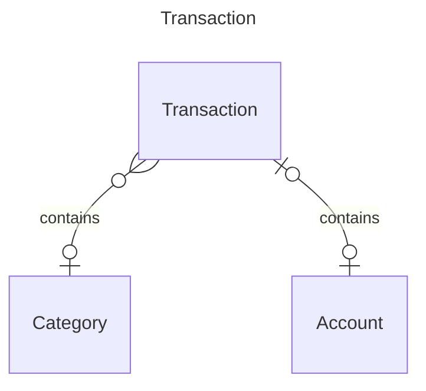

# Expense Tracker

`Expense Tracker` simplifies the management of your finances by effortlessly monitoring and organizing your expenses, helping you stay on top of your spending habits.

## Build the container

```bash
docker build -t expense-tracker:v1 .
```

## Run the app

```bash
docker compose up
```

## Query the API using curl

Read

```bash
curl http://127.0.0.1:3000/categories
```

Create

```bash
curl --header "Content-Type: application/json" --request POST --data '{"name":"college"}' http://127.0.0.1:3000/categories
```

Update

```bash
curl -X PUT -H "Content-Type: application/json" -d '{"name":"vacation"}' http://127.0.0.1:3000/categories/<id>

```

Delete

```bash
curl -X DELETE http://127.0.0.1:3000/categories/<id>
```

## Expense Tracker


