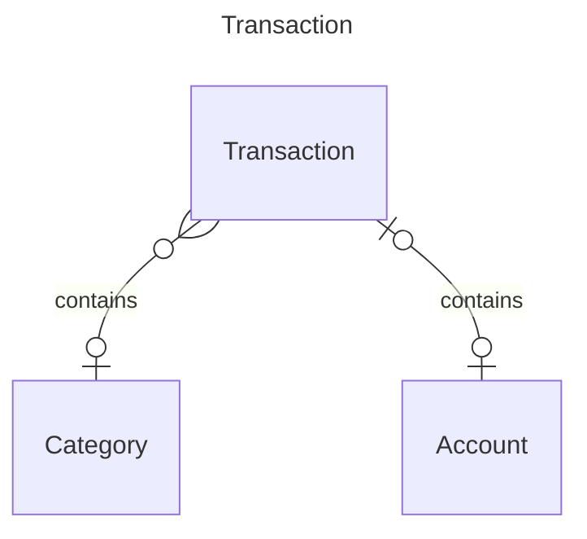
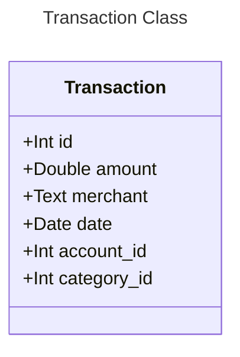
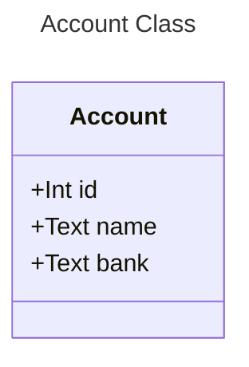
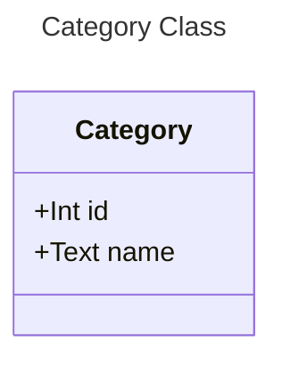

# Expense Tracker

## Run the app

Get the IP address of the postgres container

```bash
docker inspect 93350be904b0 -f '{{range.NetworkSettings.Networks}}{{.IPAddress}}{{end}}'
```

```bash
docker compose up
```

```bash
source .env
```

To start the development app

```bash
npm run dev
```

## Query the API using curl

Create - POST
Read - GET
Update - PUT
Delete - DELETE

Read

```bash
curl http://127.0.0.1:3000/categories
```

Create

```bash
curl --header "Content-Type: application/json" --request POST --data '{"name":"college"}' http://127.0.0.1:3000/categories
```

Update

```bash
curl -X PUT -H "Content-Type: application/json" -d '{"name":"vacation"}' http://127.0.0.1:3000/categories/<id>

```

Delete

```bash
curl -X DELETE http://127.0.0.1:3000/categories/<id>
```

## Expense Tracker



## Classes


