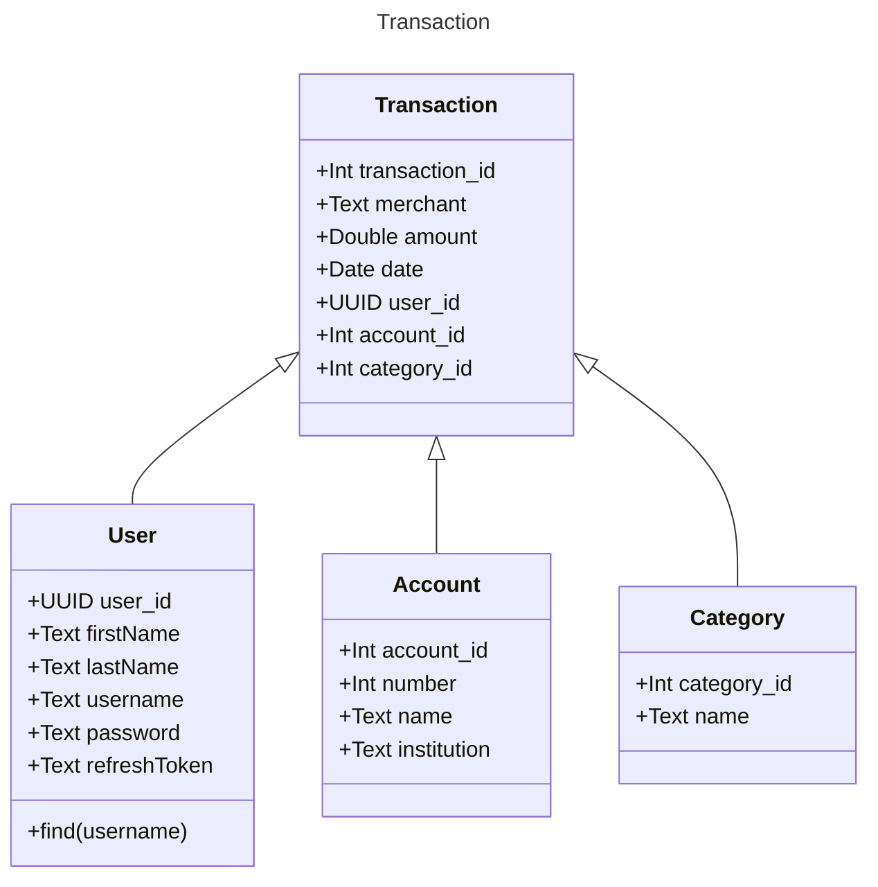

# Class Diagram

```mermaid
---
title: Transaction
---
classDiagram
    Transaction <|-- User
    Transaction <|-- Account
    Transaction <|-- Category

    class User
    User : +UUID user_id
    User : +Text firstName
    User : +Text lastName
    User : +Text username
    User : +Text password
    User : +Text refreshToken
    User : +find(username)

    class Transaction
    Transaction : +Int transaction_id
    Transaction : +Text merchant
    Transaction : +Double amount
    Transaction : +Date date
    Transaction : +UUID user_id
    Transaction : +Int account_id
    Transaction : +Int category_id

    class Account
    Account : +Int account_id
    Account : +Int number
    Account : +Text name
    Account : +Text institution

    class Category
    Category : +Int category_id
    Category : +Text name
```
