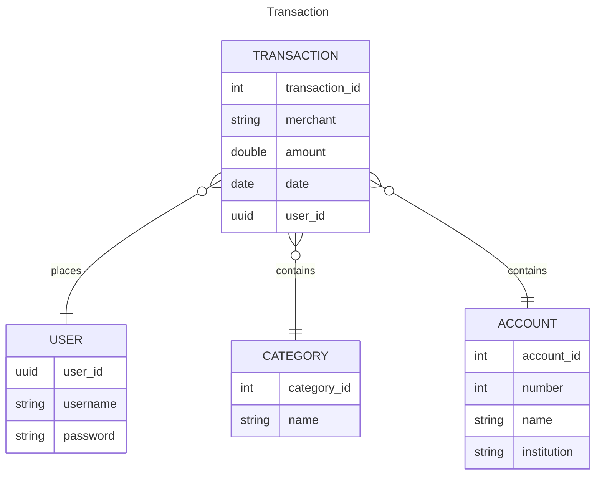

# Entity Relationship Diagram

```mermaid
---
title: Transaction
---
erDiagram
    USER {
        uuid user_id
        string username
        string password
    }
    TRANSACTION {
        int transaction_id
        string merchant
        double amount
        date date
        uuid user_id
    }
    ACCOUNT {
        int account_id
        int number
        string name
        string institution
    }
    CATEGORY {
        int category_id
        string name
    }
    TRANSACTION }o--|| USER : places
    TRANSACTION }o--|| CATEGORY : contains
    TRANSACTION }o--|| ACCOUNT : contains
```
